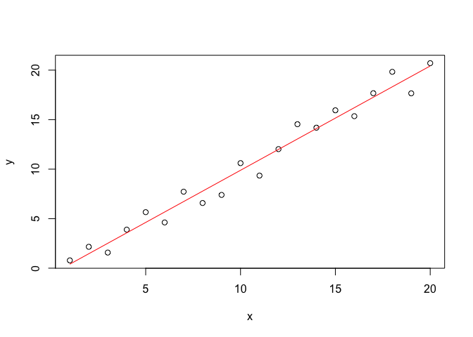

Basic Interactions
================

The only meaningful way of interacting with R is by typing code into the
R console. R’s command prompt is a ‘\>’ sign. (You don’t type the ‘\>’.)
When present, R is waiting for the next line of code. (You do hit the
return key at the end of the line.)

The prompt looks like this:

    > _

In the absence of the prompt, R is busy with calculations. Anything you
type meanwhile, will be evaluated *after* the current command has
completed.

In case a line is (syntactically) incomplete after you hit the return
key, R will continue the next line with a ‘+’ waiting for you to
complete the command.

> If at any point you want to abort the execution of a running command,
> or if you cannot figure out how to correctly complete the current line
> of input, hit Ctrl + C.

You quit the R session with the command `q()` or `quit()`.

## Code and Comments

In the following, pieces of R code (‘chunks’) are presented in grey
boxes. You can copy the commands from these chunks to your R console and
execute them by yourself. Beware that R is a case-sensitive language; so
`A` and `a` are different symbols.

For the sake of reproducibility, some chunks are directly followed by
the output that you should obtain on your machine. In this case, the
lines are prefixed with a ‘\#\#’ mark.

> In R, the ‘\#’ sign serves as comment character and can appear nearly
> anywhere in the code. Anything typed behind this sign will be
> invisible to R.

If you want to recall, (modify) and reexecute a previous command, you
can navigate the command history by using the up- and down-arrow keys on
your keyboard. In RStudio, you can access your command history in the
‘History’ pane, which is next to the ‘Environment’ pane by default.

## A Sample Session

To break the ice, you can run the following chunk that will demonstrate
one simple application of R: Fitting a linear regression model to some
noisy data.

``` r
# create a “list” of values from 1 to 20
x <- 1:20
# use this list to create a “table” with two columns x and y; add
# some noise to the y observations
d <- data.frame(x = x, y = x + rnorm(x))
# make a plot
plot(d)
# fit a linear regression
r <- lm(y ~ x, data = d)
# add to plot
lines(x, r$fitted.values, col = "red")
```

<!-- -->

``` r
# get the statistics of the fit
summary(r)
```

    ## 
    ## Call:
    ## lm(formula = y ~ x, data = d)
    ## 
    ## Residuals:
    ##      Min       1Q   Median       3Q      Max 
    ## -2.35138 -0.08822  0.24190  0.61132  1.57256 
    ## 
    ## Coefficients:
    ##             Estimate Std. Error t value Pr(>|t|)    
    ## (Intercept)  0.07681    0.45867   0.167    0.869    
    ## x            0.97944    0.03829  25.580 1.33e-15 ***
    ## ---
    ## Signif. codes:  0 '***' 0.001 '**' 0.01 '*' 0.05 '.' 0.1 ' ' 1
    ## 
    ## Residual standard error: 0.9874 on 18 degrees of freedom
    ## Multiple R-squared:  0.9732, Adjusted R-squared:  0.9717 
    ## F-statistic: 654.4 on 1 and 18 DF,  p-value: 1.326e-15

``` r
# clean up
rm(x, d, r)
```

## Expressions and Assignments

Code to interact with R will fall into one of two categories.

1.  Expressions:
    
    ``` r
    1 + sin(pi/2) 
    ```
    
        ## [1] 2
    
    ``` r
    nchar("math") # number of characters in the word “math”
    ```
    
        ## [1] 4

2.  Assignments:
    
    ``` r
    x = 1  # right-hand side (RHS) is assigned to left-hand side (LHS)
    
    y <- 2 # RHS is assigned to LHS
    3 -> z # LHS is assigned to RHS
    ```

When expressions are typed, R will evaluate them and print the result
(unless specifically made invisible). The result of an expression is
however ‘lost’ for further usage. — Assignments on the other hand do not
print to the console, but store the result in the current environment or
modify an existing value in the memory.

> It is not important (but good practice) to leave a space between the
> LHS and RHS of `=`, `->`, `<-`, and after `,`.

### Expressions

Although expressions are not limited to mathematical expressions in a
colloquial sense, R comes with a lot of operators and functions to do
anything from boolean to matrix algebra, over statistics and modelling.
Thus, R can be used as a very fancy calculator.

Some of the arithmetic operators implemented in R include:

| operator    | effect             |
| ----------- | ------------------ |
| `+`         | addition           |
| `-`         | subtraction        |
| `*`         | multiplication     |
| `/`         | division           |
| `%/%`       | integer division   |
| `%%`        | modulo (remainder) |
| `^` or `**` | exponention        |

``` r
13 %/% 4
13 %% 4

# check out the result of these ‘tricky’ cases
1/0
1/0 + 1/0
(-8)^(1/3)
```

Some of the built-in functions for other mathemtatical operations
include `abs(...)`, `floor(...)`, `round(...)`, `sqrt(...)`, `exp(...)`,
`log(...)`, `sin(...)`, `cos(...)`, etc.

R follows the standard order of operations and groupings based on
parentheses.

``` r
6 + 9 / 3
(6 + 9) / 3
```

### Using a Pipe

Besides grouping by parentheses, there is also another way to specify
the order in which expressions are evaluated. Namely, by *piping* the
different operations in the very order they must be executed by R. The
‘pipe’ is designated by the `%>%` operator. This operator is so useful
that it has its own key-binding in RStudio, which is Ctrl/Cmd + Shift +
M.

We can obtain the same result as above with

``` r
library(magrittr) # allow to use pipe

9 %>% divide_by(3) %>% add(6) 
6 %>% add(9) %>% divide_by(3)
```

Piping is very effective, when multiple functions would else be nested:
It helps to unclutter code.

``` r
# compare ...
asin(sqrt(divide_by(sum(1, 2, 3, 4), 10)))

# ... and ...
sum(1, 2, 3, 4) %>% 
  # comments may be interspresed to give rationales
  divide_by(10) %>% 
  # functions with a single argument, may omit brackets ...
  sqrt %>% 
  asin
```

### Assignments

While using R as a calculator is interesting, to do useful things, we
need to assign *values to objects*. In R, the assignment operator `<-`
(or `->`) points from the value to the object. The ‘=’ sign can also be
used for assignments.

Objects can be given any name (also known as the object’s ‘symbol’),
except that

  - names cannot start with a number, and
  - names cannot be identical to reserved words such as `if`, `TRUE`,
    `NA`, `...` etc. (type `?Reserved` for a complete list).

> Beware that you might unintentionally **overwrite built-in objects**
> such as `mean`, `data`, `df` etc. When in doubt, check the help to see
> if the name is already in use. RStudio will show you a list of all
> currently known objects and functions that start with the characters
> you just typed, when you hit the ‘tab’ key.

Although there is no restriction in length for object names, in
practice, you want your names to be explicit and not too long.

``` r
N_Avogrado = 6.022e23 # we cannot use NA as name!

N_fmol = 2
N_abs  = N_fmol * N_Avogrado * 1e-15

# print the result
N_abs
```

    ## [1] 1204400000

You can see which objects are currently loaded in R’s memory (the
‘Global Environment’) by checking the ‘Environment’ pane in RStudio or
by typing `ls()` (or `objects()`) in the R console.

To remove objects from R’s memory, use the `rm(...)` function.

``` r
ls()
```

    ## [1] "N_abs"      "N_Avogrado" "N_fmol"

``` r
rm(N_abs, N_Avogrado)
ls()
```

    ## [1] "N_fmol"

### Functions

If a sequence of operations has to be repeatedly performed, it can be
very effective to evoke this sequence of operations using a single
command: A function. In doing so, your code will gain enormously in
power, convenience and elegance.

A function is created with `function(...) {...}`. As every R object,
functions can be assigned to a symbol for future reference. The
arguments (variables *and/or* parameters) are given between round
brackets in the function call, the operations to execute follow in curly
brackets.

``` r
fmol_to_abs <- function(x_in_fmol) {
  
  N_Avogrado = 6.022e23
  
  N_abs = x_in_fmol * N_Avogrado * 1e-15
  
  return(N_abs)
  
}

fmol_to_abs(10)     # calculate for x_in_fmol = 10
```

    ## [1] 6.022e+09

``` r
fmol_to_abs(N_fmol) # calculate for x_in_fmol = N_fmol, which is still assigned the value 2
```

    ## [1] 1204400000

Note that neither `N_abs` nor `N_Avogrado` have been added to the
‘Global Environment’.

``` r
ls()
```

    ## [1] "fmol_to_abs" "N_fmol"

Note that even if we had\_assigned the same symbol `N_Avogrado = 1` in
the ‘Global Environment’, our function *would still prioritize* the
‘locally’ defined symbol `N_Avogrado`, which is `6.022e23`. Only if we
had *not* defined this variable *inside* the function, R would start
looking for it outside the function. This is called ‘scoping’.

If the last statement in a function is an expression (instead of an
assignment), it is implicitly returned. So, we can simplify.

``` r
fmol_to_abs <- function(x_in_fmol) {
  
  N_Avogrado = 6.022e23
  
  x_in_fmol * N_Avogrado * 1e-15
  
}

fmol_to_abs(N_fmol)
```

    ## [1] 1204400000

It is possible to make the the return value of the function dependend on
additional parameters, so that the function can be applied to different,
yet similar problems. If a function takes a number of parameters, it can
be convenient to assign default values to some arguments.

``` r
mol_to_abs <- function(x, prefix = "f") {
  
  prefix_meaning = c("a" = 1e-18, # “c” is a function that combines values into a “list”
                     "f" = 1e-15, 
                     "p" = 1e-12,
                     "n" = 1e-09,
                     "µ" = 1e-06,
                     "m" = 1e-03)
  
  x * 6.022e23 * prefix_meaning[[prefix]]
  
}
```

If an argument with a default is omitted from the function call, R will
silently use the default value.

``` r
mol_to_abs(N_fmol)           # amount in fmol to absolute numbers
mol_to_abs(20, prefix = "µ") # amount in µmol to absolute numbers
```

Unnamed arguments are interpreted in the positional order given in the
function’s definition. Named arguments can be provided in any order. The
following expressions thus return the same value.

``` r
mol_to_abs(20, "µ")
mol_to_abs(prefix = "µ", x = 20)
```

## Packages

Not all functions are loaded by default into R’s memory. Also, not all
functions required for a task might even be included in the “standard
distribution” of R. Therefore, users can write, deposit and load
extensions to the R software, which come as bundles of functions and/or
other objects in so-called ‘packages’.

### Installing a New Package

R packages can be found anywhere on the internet, but most reliably,
they are obtained from the ‘Comprehensive R Archive Network’
([CRAN](https://cran.rstudio.com)), the main repository of contriubted R
packages.

To install a CRAN package that is not on your machine, e.g. the
`magrittr` package from CRAN.

``` r
install.packages("magrittr")
```

To uninstall a package, use `remove.packages(...)`. (You will rarely
need this.)

### Loading a Package

A few packages are attached when R starts up. To load an additional
package into R’s memory, use

``` r
library("magrittr")
```

All of the package’s function will now be known in the current R
session. More specifically, their ‘namespace’ has been attached to the
search path of the current environment. To check which namespaces are
currently known, type `loadedNamespaces()`. To remove a namespace from
the current session, type `unloadNamespace(...)` with the respective
package name.

Note that packages may depend on functions provided by other packages
(which are automatically installed and silently loaded along with it).
You cannot unload their namespaces unless you unload all the dependend
packages.

### Referring to Functions from a Specific Package

If you intend to use only a single function from a package (and do not
want to attach the entire namespace), or if there are functions with the
same name from different packages loaded, you must be more explicit and
prefix the function call with the package name separated by `::`, e.g.
`magrittr::divide_by(...)`.

> When you load a package with conflicting names, R will print a warning
> message.

## Getting Help

No need to say, there are probably very few questions and problems that
another person has not yet dared asking on the internet. Some
suggestions are listed on
[https://www.r-project.org/help.html](https://www.r-project.org/help.html#r-help-on-the-internet).

However, if you want to work offline and/or get to know the how and why,
you can do it with R\!

### Checking the Source Code

To ‘see’ the code that a function executes, just type its name without
parentheses into the R console.

``` r
mol_to_abs
```

    ## function(x, prefix = "f") {
    ##   
    ##   prefix_meaning = c("a" = 1e-18, # “c” is a function that combines values into a “list”
    ##                      "f" = 1e-15, 
    ##                      "p" = 1e-12,
    ##                      "n" = 1e-09,
    ##                      "µ" = 1e-06,
    ##                      "m" = 1e-03)
    ##   
    ##   x * 6.022e23 * prefix_meaning[[prefix]]
    ##   
    ## }

Most R functions (except for the primitve ones) are written in R and
therefore no different from user-defined functions.

### Checking the Documentation

Sometimes, just reading a function’s code can be rather enigmatic.
Therefore, all (all\!) of the built-in functions come with an extensive
documentation. Here is how you get there.

1.  *If you know the command’s name,* the following approach will open
    the appropriate documentation. As an example, examine the help for
    the `sum(...)` function.
    
    ``` r
    help(sum)
    help("sum")
    ?sum
    ```
    
    Typically, the help page includes the following sections:
    
      - **Description** states briefly what the function does,
      - **Usage** specifies all arguments (variables and parameters) in
        positional order with their default values; here `...`
        represents any arbitrary number of comma-separated (unquoted)
        arguments,
      - **Arguments** enlists each of the arguments and the data type
        expected,
      - **Details** is a (often long) section that describes the
        function’s behaviour, its intended usage, and any other
        important details on how the function operates,
      - **Value** explicitly describes the return value of the function,
      - **Examples** gives illustrative code that serves the better
        understanding the function’s behavior.
    
    Here is some useful advice on how to read a help file from Patrick
    Burns’ [Impatient
    R](https://www.burns-stat.com/documents/tutorials/impatient-r/#readhelp):
    
      - Help files are not novels. Don’t feel compelled to read them
        from start to finish\!
      - Focusing on the examples may be a good strategy, provided there
        are good examples in the help file of course …
      - Try it out\! It may not be wise to expect yourself to understand
        everything before you use the function.

2.  *If you do not know the exact name of the function you are looking
    for,* but you know what the function *should* be able to do for you,
    the following commands will be helpful.
    
    ``` r
    help.search("histogram")
    ??histogram
    ```

Many packages include ‘vignettes’, which are documents to illustrate and
explain facilities in the package. You can discover vignettes by
accessing the index of the help page for a package or e.g. via
`browseVignettes(package = "magrittr")`.

Many packages may also include extended code demonstrations, called
‘demos’. Access e.g. via `demo(package = "stats")`.

## Errors and Warnings

R produces errors and warnings. Both write a message to your console.
The difference is that errors halt the execution of the command, but
warnings don’t.

Although there are endless ways of getting an error, R is usually very
good in pointing you to the source of an error.

Common sources of errors include

  - missing **commas**,
  - unmatched **parentheses**, or trying to match parentheses of
    different kinds,
  - **names/symbols** being incorrectly spelled, or their capitalization
    being wrong, or the
  - packages or files with the object’s definition not being attached to
    the current namespace.

Warnings are not as serious as an error. However, ignoring a warning can
be very serious if it is suggesting that the answer you got was bogus.

> Always (always\!) *read* the warning messages to check if they
> indicate a real problem or not.

## Learning Objectives

In this introduction you should have learned

  - how to create an object, consisting of a value and a name,
  - how to check which objects are currently in R’s memory, and
  - how to remove them,
  - what a ‘function’ does conceptually,
  - what a ‘package’ is conceptually,
  - how to find help, and
  - which information is in the documentation.

Quick questions.

1.  What do `#`, `%>%`, and `->` mean?
2.  How do you type `{`, `}`, `[`, and `]` on your keyboard?
3.  Check out the documentation for `rm`. Can you figure out what
    `rm(list = ls())` will do? Do it\!
