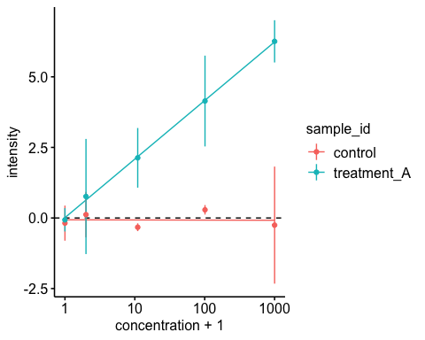

Working with Tables
================

A ‘table’, in R called a `data.frame`, is organized in columns and rows.
Each column can hold only a *single* data type; but columns can have
*different* data types. `data.frame`s are thus created *by column*.
(Technically speaking, `data.frame`s are `list` objects in which each
element of the list is an atomic vector of the same length.)

There are (at least) three different flavours to work with `data.frame`
in R:

1.  Base R uses `list`-like syntax to access `data.frame` objects; this
    can however easily get cumbersome to work with.
2.  The **`data.table` package**, which uses SQL-like syntax to access
    `data.table` objects, a class similar to `data.frame`, but built for
    maximum efficiency.
3.  The **`dplyr` package**, which uses language-like syntax to describe
    the actions applied to `tibble` objects, another class similar to
    `data.frame`.

We will focus on using `dplyr`, which is part of the
    `tidyverse`.

``` r
library(tidyverse)
```

    ## ── Attaching packages ──────────────────────────────────────────────────────────────────────────── tidyverse 1.2.1 ──

    ## ✔ ggplot2 3.2.1     ✔ purrr   0.3.2
    ## ✔ tibble  2.1.3     ✔ dplyr   0.8.3
    ## ✔ tidyr   0.8.3     ✔ stringr 1.4.0
    ## ✔ readr   1.3.1     ✔ forcats 0.4.0

    ## ── Conflicts ─────────────────────────────────────────────────────────────────────────────── tidyverse_conflicts() ──
    ## ✖ dplyr::filter() masks stats::filter()
    ## ✖ dplyr::lag()    masks stats::lag()

> Note that in the `tidyverse` you will see extensive use of
> quasiquotation. This means you can refer e.g. to column names (which
> are usually `character`) without quotation marks (`""` or `''`).
> Though, some arguments accept `character` vectors only. These must be
> quoted.

> Related to this, you might see underscore versions of some `tidyverse`
> commands popping up in RStudio’s command completion. Ignore them.

## A Typical Table in Biosciences

The plate is the experimental default table in the Biosciences.

In the worst case, the data acquired from each position (well, spot,
etc.) on the plate is saved like this:

|          |   A   |    B    |    C    |    D    |    E    |
| :------: | :---: | :-----: | :-----: | :-----: | :-----: |
| <b>1</b> | 0.016 |  0.941  | \-0.307 | \-0.002 |  0.007  |
| <b>2</b> | 0.049 | \-0.063 |  0.301  |  0.150  | \-0.704 |
| <b>3</b> | 6.477 |  3.839  |  3.064  |  0.479  |  0.182  |
| <b>4</b> | 5.755 |  3.728  |  2.153  | \-0.080 |  0.204  |

Of course, the sample assignments have been documented (somewhere). So,
we know that *the actual data* should be annotated like
this.

|                     |                     | conc\_1 | conc\_2 | conc\_3 | conc\_4 | conc\_0 |
| :-----------------: | :-----------------: | :-----: | :-----: | :-----: | :-----: | :-----: |
|   <b>control</b>    | <b>replicate\_1</b> |  0.016  |  0.941  | \-0.307 | \-0.002 |  0.007  |
|   <b>control</b>    | <b>replicate\_2</b> |  0.049  | \-0.063 |  0.301  |  0.150  | \-0.704 |
| <b>treatment\_A</b> | <b>replicate\_1</b> |  6.477  |  3.839  |  3.064  |  0.479  |  0.182  |
| <b>treatment\_A</b> | <b>replicate\_2</b> |  5.755  |  3.728  |  2.153  | \-0.080 |  0.204  |

Imagine this data appearing in some spreadsheet software.

1.  How easily could you incorporate the information of the
    concentrations, which was conc\_1 = 1000 µM, conc\_2 = 100 µM,
    conc\_3 = 10 µM, conc\_4 = 1 µM, conc\_0 = 0 µM?
2.  Would you be able to calculate the mean and standard deviation of
    the replicates for all samples?
3.  Would it take long to plot the dependence of the measured value on
    the concentration?
4.  Could you test-wise exclude a set of replicates and check the
    outcome? How about adding another set of observations and answer all
    the same questions?

The following calculation takes four lines of code in R …

|   sample\_id | concentration |    mean |    sd |
| -----------: | ------------: | ------: | ----: |
|      control |          0 µM | \-0.348 | 0.503 |
|      control |          1 µM |   0.074 | 0.107 |
|      control |         10 µM | \-0.003 | 0.430 |
|      control |        100 µM |   0.439 | 0.710 |
|      control |       1000 µM |   0.032 | 0.023 |
| treatment\_A |          0 µM |   0.193 | 0.016 |
| treatment\_A |          1 µM |   0.199 | 0.395 |
| treatment\_A |         10 µM |   2.609 | 0.644 |
| treatment\_A |        100 µM |   3.784 | 0.078 |
| treatment\_A |       1000 µM |   6.116 | 0.511 |

… and six more lines for the
plot.

<!-- -->

So, let’s start\!

The data for this plate has been saved in a file called ‘plates.RData’.
When you load this file to R’s memory (the ‘Global Environment’), there
should be (at least) one object called `plate_1` and a named vector
called `dose`.

``` r
load(file = "./part_10-working_with_tables_files/plates.RData")
```

Which class and data type do these objects belong to?

## Tidy Data

Data can be tabulated in one of two ways: A tidy and a messy one.

> If each variable forms a column and each row represents a single
> observation, we refer to this as **tidy data**.

Having your data tidied is crucial for facilitating data manipulation,
modelling, and visualization\!

Here are some guidelines:

1.  Don’t use values as column headers, all column headers should be
    variable names.
2.  Don’t put multiple variables in a single column.
3.  Don’t store variables in both rows and columns.
4.  Avoid storing multiple types of observational units in the same
    table.

Typically, if the table with your data is wider than long (if it is in
the ‘wide’ format), it’s easy to encounter messy data. For example,
`plate_1` is in one (of many possible) wide and messy formats: The
parameter concentration is stored along the header row, not in a
separate column.

A tidyer wide format would look like that:

|    replicate\_id    | concentration  | control | treatment\_A |
| :-----------------: | :------------: | :-----: | :----------: |
| <b>replicate\_1</b> | <b>conc\_0</b> |  0.007  |    0.182     |
| <b>replicate\_1</b> | <b>conc\_1</b> |  0.016  |    6.477     |
| <b>replicate\_1</b> | <b>conc\_2</b> |  0.941  |    3.839     |
| <b>replicate\_1</b> | <b>conc\_3</b> | \-0.307 |    3.064     |
| <b>replicate\_1</b> | <b>conc\_4</b> | \-0.002 |    0.479     |
| <b>replicate\_2</b> | <b>conc\_0</b> | \-0.704 |    0.204     |
| <b>replicate\_2</b> | <b>conc\_1</b> |  0.049  |    5.755     |

*(table abridged)*

The longer the table (‘long’ format), the tidyer the
data:

|     sample\_id      |    replicate\_id    | concentration  | intensity |
| :-----------------: | :-----------------: | :------------: | :-------: |
|   <b>control</b>    | <b>replicate\_1</b> | <b>conc\_1</b> |   0.016   |
|   <b>control</b>    | <b>replicate\_2</b> | <b>conc\_1</b> |   0.049   |
| <b>treatment\_A</b> | <b>replicate\_1</b> | <b>conc\_1</b> |   6.477   |
| <b>treatment\_A</b> | <b>replicate\_2</b> | <b>conc\_1</b> |   5.755   |
|   <b>control</b>    | <b>replicate\_1</b> | <b>conc\_2</b> |   0.941   |
|   <b>control</b>    | <b>replicate\_2</b> | <b>conc\_2</b> |  \-0.063  |
| <b>treatment\_A</b> | <b>replicate\_1</b> | <b>conc\_2</b> |   3.839   |
| <b>treatment\_A</b> | <b>replicate\_2</b> | <b>conc\_2</b> |   3.728   |
|   <b>control</b>    | <b>replicate\_1</b> | <b>conc\_3</b> |  \-0.307  |

*(table abridged)*

The `tidyr` package (part of the `tidyverse`) provides functions to help
you tidy your data. In this session, the package has already been
attached to the namespace.

### Interconverting Wide and Long Table Formats

The degree to which you want to make your table ‘longer than wide’
depends on the manipulation you want to perform. Typically, the
‘longest’ format serves as the linchpin to produce the ‘wider’
formats.

  - `tidyr::gather(...)` will gather information presented along the
    rows into a column. Sometimes this process is also called ‘melting’
    because of the equivalent `data.table::melt(...)` function.
  - `tidyr::spread(...)` will do the reverse: It makes long tables wide.
    Another term is ‘casting’ because of the `data.table::dcast(...)`
    and `reshape2::acast(...)` functions.

<!-- end list -->

``` r
plate_1 %>% 
  # make wide table long
  gather(key   = "concentration", # name of the column describing the parameter in column headers
         value = "intensity",     # name of the column describing the value in the table body
         conc_1:conc_0            # gather all columns between conc_1 and conc_0
         ) %>% 
  # print only top rows
  head(3)
```

    ##     sample_id replicate_id concentration intensity
    ## 1     control  replicate_1        conc_1     0.016
    ## 2     control  replicate_2        conc_1     0.049
    ## 3 treatment_A  replicate_1        conc_1     6.477

Instead of selecting the columns `conc_1:conc_0`, we could have
specified the columns which *not* to gather; these are somtimes called
the ‘identifying columns’. The following commands evaluate to the same
result.

``` r
plate_1 %>% 
  gather(key = "concentration", value = "intensity", 3:7) # by column index

plate_1 %>% 
  gather(key = "concentration", value = "intensity", conc_1:conc_0) # by name range

plate_1 %>% 
  gather(key = "concentration", value = "intensity", conc_1, conc_2, conc_3, conc_4, conc_0) # explicit positive

plate_1 %>% 
  gather(key = "concentration", value = "intensity", -sample_id, -replicate_id) # explicit negative
```

Let’s next spread the gathered representation of `plate_1` into a wide
table\! Maybe, we would like to see the measured intensities for
`control` and `treatment_A` side-by-side given each concentration and
the replicate.

``` r
plate_1 %>% 
  # make wide table long
  gather(key = "concentration", value = "intensity", conc_1:conc_0) %>% 
  # make long table wide
  spread(key   = sample_id, # the (unquoted) names of columns to use as column headers
         value = intensity, # the (unquoted) names of columns to populate the table body
         ) %>% 
  # print only top rows
  head(3) 
```

    ##   replicate_id concentration control treatment_A
    ## 1  replicate_1        conc_0   0.007       0.182
    ## 2  replicate_1        conc_1   0.016       6.477
    ## 3  replicate_1        conc_2   0.941       3.839
