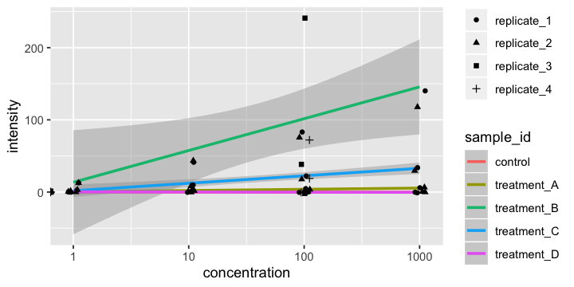
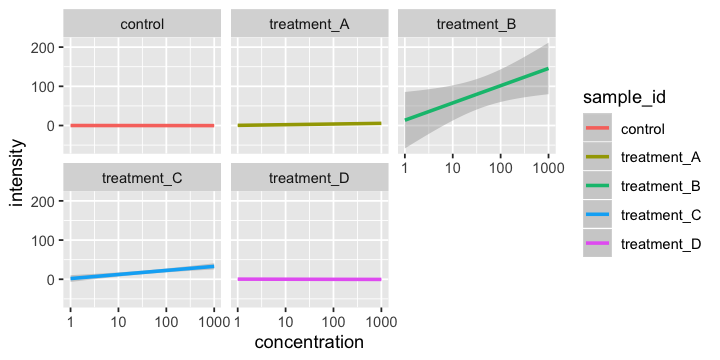
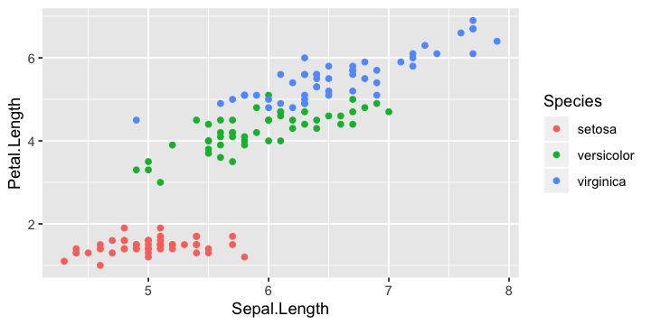
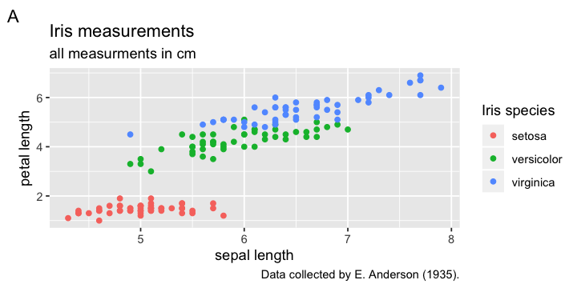
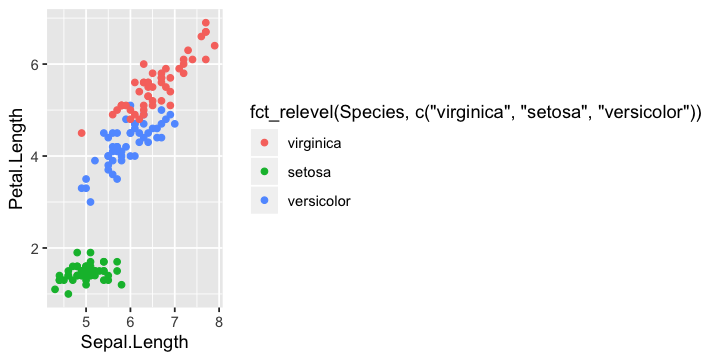
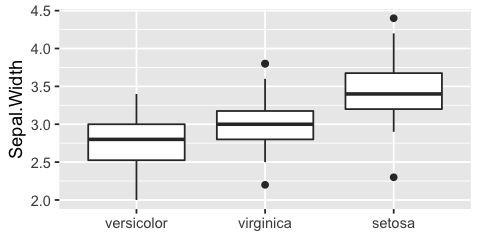
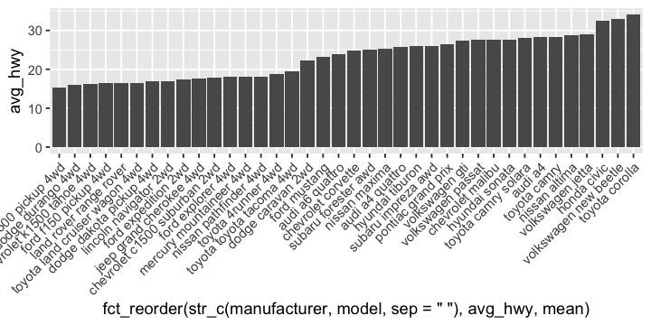

Making Figures
================

  - [The Grammar of Graphics in a
    Nutshell](#the-grammar-of-graphics-in-a-nutshell)
      - [Adding Layers](#adding-layers)
      - [Making Facets](#making-facets)
  - [Basic Operations](#basic-operations)
      - [Scenario: Formatting X and Y
        axis](#scenario-formatting-x-and-y-axis)
      - [Scenario: Renaming Axes and
        Legends](#scenario-renaming-axes-and-legends)
      - [Scenario: Reordering Factors](#scenario-reordering-factors)
  - [Extensions](#extensions)

-----

This section is about data visualization; a powerful tool for
explorative data analysis.

If you have not done so yet, please attach the `tidyverse` and make sure
you have the `plate_data` object from [this
section](part_12-manipulating_tables.md). If not, here you go.

``` r
library(tidyverse)
readRDS("part_12-plate_data.rds") -> plate_data
```

In most part, we need only the `ggplot2` package (part of the
`tidyverse`). So, most of the examples will work also if you decide
later to attach only this package.

``` r
library(ggplot2)
```

## The Grammar of Graphics in a Nutshell

The ‘gg’ in “`ggplot2`” stands for ‘grammar of graphics’ and is a system
to declaratively create plots.

To make a plot of your data, you will (only) need to tell `ggplot2`

  - how to plot the individual variables (e.g. ‘on `x`’, ‘on `y`’, ‘as
    `color`’, ‘as `fill`’, ‘as `size`’, ‘as `linetype`’, etc.) using an
    *aesthetic* `aes(...)` call, and
  - which *plot type* to use with a `geom_*` or `stat_*` statement.

The details are worked out by R.

In addition, you can

  - define the `scale_*` by which values translate into graphical
    properties (e.g. `scale_x_continuous`, `scale_x_log10`,
    `scale_color`, etc.),
  - change the coordinate system (e.g. `coord_polar`, `coord_fixed`,
    etc.),
  - subset the data by group (e.g. `facet_wrap` and `facet_grid`), or
  - define and modify the overall `theme_*` of the plot.

Here is a first look on our plate measurements.

``` r
plate_data %>% 
  ggplot(aes(x = concentration, y = intensity, color = sample_id)) +
  geom_point() +
  scale_x_log10()
```

<!-- -->

> Note that you add the different information for `ggplot2` with a `+`,
> *not* with a pipe\! It is not (easily) possible to continue piping
> after the graphic instructions. If you really do need this, use `...
> %>% {ggplot(data = ., ...) + ... } %>% ...`.

> The `+` needs to come at the end of the line, not at the start\!

As opposed to other `tidyverse` packages such as `dpylr`, it is
important in `ggplot2` to distinguish between the unquoted variables
that refer to column names and quoted strings, which are taken as is.

``` r
plate_data %>% 
  ggplot(aes(x = concentration, y = intensity, color = "sample_id")) +
  geom_point() +
  scale_x_log10()
```

<!-- -->

### Adding Layers

You can overlay multiple plot types and summary statistics. Each
`geom_*` or `stat_*` statement translates in a single layer. The order
of the layers is given by their appearance.

``` r
plate_data %>% 
  ggplot(aes(x = concentration, y = intensity, color = sample_id)) +
  # showing simply mean ± SD
  stat_summary(fun.data = mean_sdl, geom = "pointrange") +
  scale_x_log10()

plate_data %>% 
  ggplot(aes(x = concentration, y = intensity, color = sample_id)) +
  # overlaying the linear fit ...
  stat_smooth(method = lm) +  
  # ... with the single observations
  geom_point() +
  scale_x_log10()

plate_data %>% 
  ggplot(aes(x = concentration, y = intensity, color = sample_id)) +
  stat_smooth(method = lm) +
  # declutter overlaying points a little bit ...
  geom_jitter(width = .05, height = 0) +
  scale_x_log10()
```

The individual layers can have different aesthetics. If no aesthetics
are provided in a layer or missing, they are taken from the intial
`ggplot(...)` call.

``` r
plate_data %>% 
  ggplot(aes(x = concentration, y = intensity)) +
  stat_smooth(aes(color = sample_id), method = lm) +
  geom_jitter(aes(shape = replicate_id), width = .05, height = 0) +
  scale_x_log10()
```

<!-- -->

### Making Facets

Let’s have a look (again) at the fits for the individual replicates. The
grouping in `ggplot2` is determined by some aesthetics such as `color`,
`fill`, and/or `group` as well as by the facetting variables in
`facet_*`.

``` r
plate_data %>% 
  ggplot(aes(x = concentration, y = intensity, color = sample_id)) +
  stat_smooth(method = lm) +
  scale_x_log10() +
  facet_wrap(vars(sample_id))
```

<!-- -->

``` r
plate_data %>% 
  # sometimes, we need to add a pseudocount to see log-transformed values that
  # are smaller than or equal to zero ...
  ggplot(aes(x = concentration + 1, y = intensity, color = replicate_id)) +
  geom_smooth(method = lm, se = FALSE) +
  scale_x_log10() +
  facet_wrap(vars(sample_id))
```

<!-- -->

Apparently, `"replicate_3"` is no good.

## Basic Operations

### Scenario: Formatting X and Y axis

``` r
plate_data %>% 
  filter(replicate_id != "replicate_3") %>% 
  ggplot(aes(x = concentration, y = intensity / max(intensity, na.rm = TRUE), color = sample_id)) +
  geom_point() ->
  p

# different transformations along the x-axis

p + scale_x_continuous()
p + scale_x_sqrt()
p + scale_x_log10()

# different formatting of the axis texts

p + scale_x_log10(labels = scales::scientific)
p + scale_x_log10(labels = scales::comma)
p + scale_y_continuous(labels = scales::percent)

# custom breaks

p + scale_y_continuous(breaks = seq(.2, 1, .2))
```

### Scenario: Renaming Axes and Legends

Good labels are critical for making your plots accessible to a wider
audience. Our plate data was well annotated, so that we do not need to
modify the labels used. Other data might use more enigmatic
abbreviations.

The one-stop function to set most of the descriptions is `labs(...)`.
However, also short-hands like `xlab(label)` or `ylab(label)` exist.

In this example, we will use Fisher’s famous [*Iris* flower data
set](https://en.wikipedia.org/wiki/Iris_flower_data_set). It contains
150 records of Iris specimen under five variables, the petal length and
width, the sepal width and length, and the species.

``` r
iris %>% 
  ggplot(aes(x = Sepal.Length, y = Petal.Length, color = Species)) +
  geom_point()
```

<!-- -->

This is the full set of information, we could pack into the plot.

If you need to remove a label from an existing plot `p`, set the
respective argument to `NULL`, e.g. `p + labs(subtitle = NULL)`.

``` r
iris %>% 
  ggplot(aes(x = Sepal.Length, y = Petal.Length, color = Species)) +
  geom_point() +
  labs(
    title    = "Iris measurements",
    subtitle = "all measurments in cm",
    caption  = "Data collected by E. Anderson (1935).",
    tag      = "A",
    x        = "sepal length",
    y        = "petal length",
    color    = "Iris species"
  )
```

<!-- -->

### Scenario: Reordering Factors

In `ggplot2` the order in which categorical variables appear on the
plot, is determined by the order of the `levels` if they were a
`factor`. (By default, `tibble` does not convert `character` columns to
`factor`, but `data.frame` will.) Therefore, `character` vectors are
ordered alphabetically by default.

In base R, the reordering of a factor would look like this:

``` r
class(iris$Species); levels(iris$Species)
```

    ## [1] "factor"

    ## [1] "setosa"     "versicolor" "virginica"

``` r
iris$Species <- factor(iris$Species, levels = c("versicolor", "virginica", "setosa"))
levels(iris$Species)
```

    ## [1] "versicolor" "virginica"  "setosa"

``` r
# restore original object
iris <- datasets::iris
```

However, this reassignment of levels would be incompatible with (or at
least very different from) the pipe-based workflows we have used so far.
This is when the `forcats` package comes at help\!

``` r
# refactor either before plotting ...
iris %>% 
  mutate(Species = fct_relevel(Species, c("virginica", "setosa", "versicolor"))) %>% 
  ggplot(aes(x = Sepal.Length, y = Petal.Length, color = Species)) +
  geom_point()
```

<!-- -->

``` r
# ... or during plotting
iris %>% 
  ggplot(aes(x = Sepal.Length, y = Petal.Length,
             color = fct_relevel(Species, c("virginica", "setosa", "versicolor")))) +
  geom_point()
```

<!-- -->

The first approach is neat as it saves us another `labs(...)`
specification and it is especially useful when we wanted to map the same
variable with multiple aesthetics.

Some functions to change the order of factor levels include

  - `forcats::fct_relevel` for manual reodering,
  - `forcats::fct_infreq` to reorder by factor frequency,
  - `forcats::fct_inorder` to reorder by order in which they appear in
    the data,
  - `forcats::fct_rev` to reverse the order,
  - `forcats::fct_shift` to shift factor levels to the left, and
  - `forcats::fct_shuffle` to reandomly permute the order.

It is also possible to reorder levels by their (quantitative)
relationship with another variable. For example

  - to arrange the species based on their (`median`) sepal width, use
    `forcats::fct_reorder`, and
    
    ``` r
    iris %>% 
      ggplot(aes(x = fct_reorder(Species, Sepal.Width, .fun = median), y = Sepal.Width)) +
      geom_boxplot() +
      labs(x = NULL)
    ```
    
    <!-- -->

  - to reorder the species by their final values when plotted with two
    variables, sepal width against sepal length, use
    `forcats::fct_reorder2`.
    
    ``` r
    iris %>% 
      ggplot(aes(x = Sepal.Length, y = Sepal.Width, 
                 color = fct_reorder2(Species, .x = Sepal.Length, .y = Sepal.Width))) +
      geom_smooth(method = lm) +
      labs(color = "Species")
    ```
    
    <!-- -->

Here are two more examples.

Let’s reorder the fuel economy for 234 popular car models from 1999 and
2008, `mpg` by the highway miles per gallon.

``` r
mpg %>% 
  group_by(manufacturer, model) %>% 
  summarize(avg_hwy = mean(hwy)) %>% 
  ggplot(aes(y = avg_hwy)) ->
  p

# ordered by manufacturer name and model
p +
  geom_col(aes(x = str_c(manufacturer, model, sep = " "))) +
  theme(axis.text.x = element_text(angle = 45, hjust = 1))
```

<!-- -->

``` r
# reorder by hwy
p + 
  geom_col(aes(x = fct_reorder(str_c(manufacturer, model, sep = " "), avg_hwy, mean))) +
  theme(axis.text.x = element_text(angle = 45, hjust = 1))
```

<!-- -->

Arrange the motor trend car road test data `mtcars` from 1974 by the
miles per gallon (`mpg`), grouped by the number of cylinders (`cyl`).
This is unexpectedly too complicated to handle with `fct_reorder`.

``` r
# not ordered
mtcars %>% as_tibble(rownames = "model") %>% 
  ggplot(aes(x = reorder(model, mpg), y = mpg)) +
  geom_col(aes(fill = factor(cyl))) +
  geom_text(aes(label = mpg), nudge_y = .5, hjust = 0) +
  coord_flip()

# this does not work
mtcars %>% as_tibble(rownames = "model") %>% 
  group_by(cyl) %>% 
  mutate(model = fct_reorder(model, mpg, mean)) %>% 
  ggplot(aes(x = reorder(model, mpg), y = mpg)) +
  geom_col(aes(fill = factor(cyl))) +
  geom_text(aes(label = mpg), nudge_y = .5, hjust = 0) +
  coord_flip()

# reorder by mpg and group by cyl
mtcars %>% as_tibble(rownames = "model") %>% 
  arrange(cyl, mpg) %>% 
  mutate(model = factor(model, levels = model)) %>% 
  ggplot(aes(x = model, y = mpg)) +
  geom_col(aes(fill = factor(cyl))) +
  geom_text(aes(label = mpg), nudge_y = .5, hjust = 0) +
  coord_flip()
```

## Extensions

`ggplot2` provides over 30 `geom_*` statements (see the following
sections), and [extension packages](https://www.ggplot2-exts.org/)
provide even more.

Some useful extenstions (in my humble opinion) include

  - `ggrepel` to repel overlapping text labels away from each other,
  - `ggforce` and
  - `ggalt` for extra coordinate systems, geoms, statistical
    transformations, and scales,
  - `gggenes` for drawing gene arrow maps,
  - `ggridges` for ridgeline plots,
  - `ggalluvial` for alluvial diagrams.
