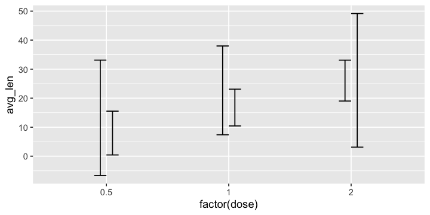

Plot Types
================

  - [Scatter Plots](#scatter-plots)
  - [Bar and Column Charts](#bar-and-column-charts)
      - [Scenario: Adding ‘Error Bars’ and Other
        Intervals](#scenario-adding-error-bars-and-other-intervals)
  - [Box Plots, Violins, Beeswarms, and
    Sinas](#box-plots-violins-beeswarms-and-sinas)
  - [Histograms and Density Plots](#histograms-and-density-plots)
      - [Scenario: Visualizing FACS
        Data](#scenario-visualizing-facs-data)
  - [QQ and ECDF Plots](#qq-and-ecdf-plots)
      - [Quantile-Quantile Plots](#quantile-quantile-plots)
      - [Empirical Cumulative Distribution Function
        Plots](#empirical-cumulative-distribution-function-plots)

-----

Let’s take a brief tour of the many possible ways to visualize data. Not
everything that’s possible might be useful. So, the following sections
are motivated rather by different scenarios than strictly by type.

``` r
library(tidyverse)
```

## Scatter Plots

We have encountered scatter plots already. They are created using
`geom_point`.

``` r
ggplot(iris, aes(Sepal.Length, Sepal.Width, color = Species)) + geom_point()
```

Because of overplotting, a particularly tricky case are scatter plots in
which two (pseudo-categorical) integer values are plotted against each
other.

Let’s take a look in the fuel economy for 234 popular car models from
1999 and 2008, `mpg`. For each model, we will plot the city miles per
gallon (`cty`) against the highway miles per gallon (`hwy`).

``` r
# basic scatter plot (overplotting)
ggplot(mpg, aes(cty, hwy)) + 
  geom_point(size = .5)
```

<!-- -->

``` r
# alternative: alpha scale (not neat)
ggplot(mpg, aes(cty, hwy)) + 
  geom_point(size = .5, alpha = .2)
```

<!-- -->

``` r
# alternative: jitter charts
ggplot(mpg, aes(cty, hwy)) + 
  geom_jitter(size   = .5, # size of the point
              width  = .4, # allowed jitter in x units
              height = .2) # allowed jitter in y units
```

<!-- -->

``` r
# alternative: count charts 
ggplot(mpg, aes(cty, hwy)) +
  geom_count()
```

<!-- -->

## Bar and Column Charts

One categorical variable is plotted along the x-axis, the (summarized)
continuous values along the y-axis.

Here is some guinea pig data on the length of odontoblasts, the cells
responsible for tooth growth, in response to three different doses of
vitamin C (0.5, 1.0, and 2.0 mg/day) delivered either as orange juice
(`OJ`) or as ascorbic acid (`VC`).

Eager to start plotting, we start with the length of the odontoblasts
against the different treatments as column chart with `geom_col`. By
default, additional categories are stacked on top of each other
(`position = "stack"`). If we want to show them side-by-side, there is
`position = "dodge"` or the function `position_dodge(...)` to exert more
control on the positioning.

``` r
ToothGrowth %>% 
  ggplot(aes(x = factor(dose), y = len, fill = supp)) +
  geom_col()
```

<!-- -->

``` r
ToothGrowth %>% 
  ggplot(aes(x = factor(dose), y = len, fill = supp)) +
  geom_col(position = position_dodge(width = .8), width = .7)
```

<!-- -->

But snap\! What we actually (over-)plotted were all the individual
observations, not the group summaries\! This means that we just see the
maximum length in each case.

``` r
ToothGrowth %>% group_by(dose, supp) %>% summarize(max(len))
```

    ## # A tibble: 6 x 3
    ## # Groups:   dose [3]
    ##    dose supp  `max(len)`
    ##   <dbl> <fct>      <dbl>
    ## 1   0.5 OJ          21.5
    ## 2   0.5 VC          11.5
    ## 3   1   OJ          27.3
    ## 4   1   VC          22.5
    ## 5   2   OJ          30.9
    ## 6   2   VC          33.9

``` r
ToothGrowth %>% 
  ggplot(aes(x = factor(dose), y = len, fill = supp)) +
  geom_col(position = position_dodge(width = .8), width = .7, color = "black")
```

<!-- -->

We should use `geom_col` only if we either computed the summary
statistics ourselves or ask `geom_bar` to do this. This relationship
between the data and the height of the bar plot is set with the `stat`
argument.

In `geom_col`, we cannot change `stat = "identity"`, i.e. plot as is.

In `geom_bar`, it defaults to `stat = "count"`, but we can change it to
`stat = "summary"` and provide a summary function with `fun.y = ...`,
e.g. `mean` (default) or `median`.

``` r
# calculate summary statistics by yourself ...
ToothGrowth %>% 
  group_by(dose, supp) %>% summarize(avg_len = mean(len)) %>% 
  ggplot(aes(x = factor(dose), y = avg_len, fill = supp)) +
  geom_bar(stat = "identity", position = "dodge") # geom_col(position = "dodge") # same
```

<!-- -->

``` r
# ... or let geom_* do it
ToothGrowth %>% 
  ggplot(aes(x = factor(dose), y = len, fill = supp)) +
  geom_bar(stat = "summary", fun.y = mean, position = "dodge")
```

<!-- -->

Let’s see how many car models of each ‘type’ of car is in the fuel
economy data set `mpg` using `geom_bar` with the default `stat =
"count"`.

``` r
ggplot(mpg, aes(x = class)) + geom_bar()
```

<!-- -->

### Scenario: Adding ‘Error Bars’ and Other Intervals

Let’s try to indicate in our plot how certain our estimates on the group
summary really is. There are various ways of representing a vertical
interval in `ggplot`.

  - `geom_crossbar` draws a ‘levitating box’ around the estimate,
  - `geom_errorbar` draws an error bar with butt ends,
  - `geom_linerange` draws the line only, and
  - `geom_pointrange` adds a point at the estimate.

In all cases, we must specify `ymin` and `ymax`, which makes it easy to
represent non-symmetric confidence intervals or similar as well.

``` r
ToothGrowth %>% 
  group_by(dose, supp) %>% summarize(avg_len = mean(len), var_len = var(len)) %>% 
  ggplot(aes(x = factor(dose), y = avg_len, fill = supp)) -> 
  p

p + geom_crossbar(aes(ymin = avg_len - var_len, ymax = avg_len + var_len), 
                  position = "dodge")
```

<!-- -->

``` r
p + geom_errorbar(aes(ymin = avg_len - var_len, ymax = avg_len + var_len), 
                  position = "dodge", width = .2)
```

<!-- -->

``` r
# because bars and error bars have different widths, we need to specify how wide the 
# objects we are dodging are

my_dodge <- position_dodge(width = 0.9)

p + 
  geom_col(position = my_dodge) +
  geom_errorbar(aes(ymin = avg_len - var_len, ymax = avg_len + var_len), 
                  position = my_dodge, width = .2)
```

<!-- -->

Let’s also plot the parameters of the fit that we calculated
[before](part_13-summarizing_tables.md#linear-regression-and-beyond)
e.g. the slope and/or the intercept of the fits.

``` r
# get the tidied plate data and calculate the linear regression on each sample, excluding the odd
# one out replicate
readRDS("part_12-plate_data.rds") %>% filter(replicate_id != "replicate_3") %>% 
  group_by(sample_id) %>% group_modify(~ broom::tidy(lm(intensity ~ log10(concentration + 1), data = .))) -> 
  plate_data.lm

plate_data.lm %>% 
  # extract the rows with the slope information ...
  filter(term != "(Intercept)") %>% 
  # ... and plot
  ggplot(aes(x = sample_id, y = estimate)) +
  geom_bar(stat = "identity", fill = "darkgray") +
  geom_linerange(aes(ymin = estimate - std.error, ymax = estimate + std.error))
```

<!-- -->

``` r
plate_data.lm %>% 
  # plot all estimates ...
  ggplot(aes(x = sample_id, y = estimate, fill = sample_id)) +
  # ... using facets
  facet_wrap(vars(term), scales = "free_y") +
  geom_bar(stat = "identity") +
  # show SEM as error bars
  geom_errorbar(aes(ymin = estimate - std.error, ymax = estimate + std.error),
                width = .2)
```

<!-- -->

For the sake of completeness: A horizontal errorbar can be added with
`geom_errorbarh`, but of course not on categorical x-axes.

> A word of caution from [S. Holmes’ and W. Huber’s book *Modern
> Statistics for Modern
> Biology*](https://books.google.de/books?id=FHaIDwAAQBAJ): For highly
> skewed or multimodal distributions or data with large outliers, the
> mean is not an appropriate summary statistic.

## Box Plots, Violins, Beeswarms, and Sinas

Presumably, we would like to visualize not only a single the summary
statistic of the data, but also convey information on the data
distribution. This is what box plots and consorts are good for.

‘Box plots’ are useful for unimodal data, i.e. data with a single peak.
For multimodal distributions, it is better to visualize the data using a
‘violin plot’ which is sort of a ‘a histogram viewed from above’.

If the number of data points is not too large, we can also use ‘jitter’
or ‘beeswarm plots’ to visualize the data directly.

However, for large data sets, this might lead to visually unpleasant
(and even obscure) overplotting of points. In particular in
computational biology, where the number of data points between treatment
conditions, bins, expriments, or data sources, etc. may differ
considerably, the ‘sina plot’—a ‘jitter plot’ contained in a
violin—comes in handy.

``` r
ToothGrowth %>% 
  ggplot(aes(x = factor(dose), y = len)) ->
  p

# box-and-whiskers plot
p + geom_boxplot()
```


``` r
# jitter plot
p + geom_jitter(width = .1)
```


``` r
# beeswarm plot
p + geom_dotplot(binaxis = "y", stackdir = "center", binwidth = 1)
```


``` r
# violin plot
p + 
  geom_violin(trim = FALSE) +
  geom_boxplot(width = .25)
```


``` r
# sina plot
p +
  geom_violin(trim = FALSE) +
  ggforce::geom_sina(method = "density")
```


## Histograms and Density Plots

Both, histograms and density plots, can be rather problematic since we
need to choose a window over which individual data points are ‘binned’
for counting (histograms) or ‘smoothed out’ (density plots). If the
window size is too small, the representation becomes ‘wiggly’, if the
window size is chosen too large, sharp peaks may be smoothed out.

In particular, it is not adequate to compare two (normalized) histograms
or two density plots if the sample sizes for both conditions differ.

However, this is how you would plot a histogram and a density plot in
`ggplot2`.

``` r
ToothGrowth %>% 
  ggplot(aes(x = len)) + facet_wrap(vars(dose,)) ->
  p

p + geom_histogram(bins = 15)
```

<!-- -->

``` r
p + geom_density()
```

<!-- -->

### Scenario: Visualizing FACS Data

A real-world example.

``` r
readRDS("part_20-FACS_data.rds") -> FACS_data
```

Let’s overlay some distributions in one channel.

``` r
FACS_data %>% 
  ggplot(aes(x = AF405.A, fill = group)) +
  geom_density(alpha = .5) +
  scale_x_log10()
```

<!-- -->

``` r
FACS_data %>% 
  ggplot(aes(x = AF405.A, fill = group)) +
  ggridges::geom_density_ridges(aes(y = group), alpha = .5) +
  scale_x_log10()
```

    ## Picking joint bandwidth of 0.0521

<!-- -->

``` r
# with some overlap ...

diamonds %>% 
  ggplot(aes(x = price, y = cut, fill = cut)) +
  ggridges::geom_density_ridges(scale = 4, alpha = .5)
```

    ## Picking joint bandwidth of 458

<!-- -->

And in two channels. (Avoid `geom_point` since it will produce
overlapping points and take a long time to plot.)

``` r
FACS_data %>% 
  ggplot(aes(x = AF405.A, y = FITC.A, color = group)) +
  geom_density2d() +
  scale_x_log10(labels = scales::scientific) +
  scale_y_log10(labels = scales::scientific)
```

<!-- -->

``` r
FACS_data %>% 
  filter(group == "cond_2") %>% 
  ggplot(aes(x = AF405.A, y = FITC.A)) +
  stat_density_2d(aes(fill = stat(density)), geom = "raster", n = 100,
                  contour = FALSE) +
  scale_fill_distiller(palette = "Spectral") +
  scale_x_log10(labels = scales::scientific) +
  scale_y_log10(labels = scales::scientific)
```

<!-- -->

If you wish a solution which is something close to pseudo-colored
density plots or base R’s `smoothScatter`.

``` r
densVals <- function(x, y = NULL, nbin = 128, bandwidth, range.x) {
  dat <- cbind(x, y)
  # limit dat to strictly finite values
  sel <- is.finite(x) & is.finite(y)
  dat.sel <- dat[sel, ]
  # density map with arbitrary graining along x and y
  map   <- grDevices:::.smoothScatterCalcDensity(dat.sel, nbin, bandwidth)
  map.x <- findInterval(dat.sel[, 1], map$x1)
  map.y <- findInterval(dat.sel[, 2], map$x2)
  # weighted mean of the fitted density map according to how close x and y are
  # to the arbitrary grain of the map
  den <- mapply(function(x, y) weighted.mean(x = c(
    map$fhat[x, y], map$fhat[x + 1, y + 1],
    map$fhat[x + 1, y], map$fhat[x, y + 1]), w = 1 / c(
    map$x1[x] + map$x2[y], map$x1[x + 1] + map$x2[y + 1],
    map$x1[x + 1] + map$x2[y], map$x1[x] + map$x2[y + 1])),
    map.x, map.y)
  # replace missing density estimates with NaN
  res <- rep(NaN, length(sel))
  res[sel] <- den
  res
}

FACS_data %>% 
  filter(group == "cond_2") %>% 
  mutate(
    AF405.A = log10(AF405.A),
    FITC.A  = log10(FITC.A)) %>% 
  mutate(
    point_density = densVals(AF405.A, FITC.A)) %>% 
  ggplot(aes(x = AF405.A, y = FITC.A)) ->
  p

# with points colored according to density
p + 
  geom_point(aes(color = point_density))
```

<!-- -->

``` r
# with density map showing the sparsest points only
p + 
  stat_density2d(geom = "raster", aes(fill = ..density.. ^ 0.25), contour = FALSE) +
  scale_fill_gradientn(colours = colorRampPalette(c("white", blues9))(256)) +
  # show only the 100 sparesest points
  geom_point(data = dplyr::top_n(p$data, 100, -point_density), size = .5)
```

<!-- -->

## QQ and ECDF Plots

There are some other type of plots which are useful for a diagnostic
survey of the data.

### Quantile-Quantile Plots

These are used to visualize whether the distribution of values within an
observed variable follow a distribution such as a normal distribution.
You can set the distribution to plot against with the `distribution`
parameter.

``` r
# perfectly normal distributed data will fall on a diagonal
rnorm(1000) %>% as_tibble %>% 
  ggplot(aes(sample = value)) +
  stat_qq() +
  stat_qq_line()
```

<!-- -->

``` r
# real data
mtcars %>% 
  rename(miles_per_gallon = mpg, cylinders = cyl) %>% 
  ggplot(aes(sample = miles_per_gallon, color = factor(cylinders))) +
  stat_qq() +
  stat_qq_line()
```

<!-- -->

### Empirical Cumulative Distribution Function Plots

These are the better histograms and density plots because

  - it contains all the information contained in the original sample
    without smoothing or binning, and
  - it converges against the ‘true’ cumulative distribution function as
    the number of observations grows.

<!-- end list -->

``` r
mtcars %>% 
  rename(miles_per_gallon = mpg, cylinders = cyl) %>% 
  ggplot(aes(x = miles_per_gallon, color = factor(cylinders))) +
  stat_ecdf()
```

<!-- -->

``` r
ggplot(iris, aes(Sepal.Length, color = Species)) + 
  stat_ecdf()
```

<!-- -->
