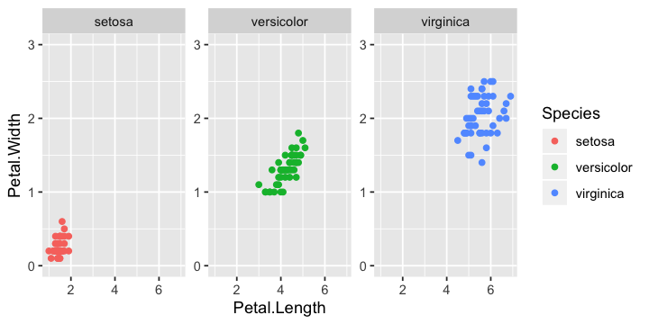

More Plotting Scenarios
================

  - [Scenario: Highlighting a Group within
    Plots](#scenario-highlighting-a-group-within-plots)
  - [Scenario: Encircling Groups](#scenario-encircling-groups)
  - [Scenario: Zooming into Plots](#scenario-zooming-into-plots)
  - [Scenario: Adding Significance
    Levels](#scenario-adding-significance-levels)
  - [Scenario: Repeating Axes in
    Facets](#scenario-repeating-axes-in-facets)
  - [Scenario: Splitting Multiple Plots in Distinct
    Pages](#scenario-splitting-multiple-plots-in-distinct-pages)
  - [Scenario: More Control on Legend
    Positioning](#scenario-more-control-on-legend-positioning)

-----

Some assortment of frequently demanded or particularly tricky tasks.
Most of them require some extensions to `ggplot2`.

``` r
library(tidyverse)
```

### Scenario: Highlighting a Group within Plots

There are different way to change the representation of a subset of the
data.

  - Either you add another variable (column) to your data that specifies
    the grouping. (Neat.)
    
    ``` r
    mpg %>% mutate(my_group = if_else(hwy > 40, "grp_a", "grp_b")) %>% 
    ggplot(aes(x = displ, y = hwy, shape = my_group, color = my_group)) +
    geom_point()
    ```
    
    <!-- -->

  - You make a conditional aesthetic mapping. (A little bit cumbersome.)
    
    ``` r
    mpg %>% ggplot(aes(x = displ, y = hwy)) +
    geom_point(aes(shape = if_else(hwy > 40, 17, 16),
                   color = if_else(hwy > 40, "red", "black"))) + 
    scale_color_identity() + 
    scale_shape_identity()
    ```
    
    <!-- -->

  - You subset the data and plot the subsets separately.
    
    ``` r
    mpg %>% {ggplot(., aes(x = displ, y = hwy)) +
    geom_point(data = subset(., hwy <= 40), shape = 16) +
    geom_point(data = subset(., hwy >  40), shape = 17, color = "red")}
    ```
    
    <!-- -->

### Scenario: Encircling Groups

The `geom_mark_*` family of `ggforce` can encircle your data with
different shapes (and optionally label it).

``` r
iris %>% 
  ggplot(aes(x = Sepal.Length, y = Petal.Length, color = Species)) +
  geom_point() +
  ggforce::geom_mark_ellipse(aes(label = Species, filter = Species != 'setosa'), label.fontsize = 11)
```

<!-- -->

### Scenario: Zooming into Plots

``` r
iris %>% 
  ggplot(aes(x = Petal.Length, Petal.Width, colour = Species)) +
  geom_point() +
  ggforce::facet_zoom(x = Species == 'versicolor')
```

<!-- -->

### Scenario: Adding Significance Levels

If you insist doing it with R, there is of course a solution:
`ggsignif`. It will calculate and the statistic for the specified
comparisons. Note that you have to apply corrections for multiple
testing manually if applicable.

By default, a `wilcox.test` is used. But you can specify another (or
even your own) test using the `test = ...` argument. A starred version
of significance levels is returned by setting `map_signif_level = TRUE`.

``` r
ggplot(mpg, aes(class, hwy)) +
  geom_boxplot() +
  ggsignif::geom_signif(comparisons = list(c("compact", "pickup"),
                                           c("subcompact", "suv")),
                        map_signif_level = function(p) sprintf("p = %.2g", p)) +
  # add some more space in y direction
  scale_y_continuous(expand = c(0, 5)) +
  facet_wrap(vars(year))
```

<!-- -->

It is *not* possible to calculate differences between factors grouped by
`fill`. But here is a work-around.

``` r
ToothGrowth %>% 
  ggplot(aes(x = factor(dose) : supp, y = len, fill = supp)) +
  geom_bar(stat = "summary", fun.y = mean, position = "dodge") +
  ggsignif::geom_signif(comparisons = list(c("0.5:OJ", "0.5:VC"), c("1:OJ", "1:VC"), c("2:OJ", "2:VC")),
                        map_signif_level = TRUE) +
   # add some more space in y direction
  scale_y_continuous(expand = c(0, 5))
```

<!-- -->

### Scenario: Repeating Axes in Facets

``` r
iris %>% 
  ggplot(aes(x = Petal.Length, Petal.Width, colour = Species)) +
  geom_point() +
  # repeats the scale with different spacing between facets
  facet_wrap(vars(Species), scales = "free_y")
```

<!-- -->

``` r
iris %>% 
  ggplot(aes(x = Petal.Length, Petal.Width, colour = Species)) +
  geom_point() +
  # repeats the scale with same minimum in all facets
  scale_y_continuous(limits = c(0, NA)) +
  facet_wrap(vars(Species), scales = "free_y")
```

<!-- -->

``` r
iris %>% 
  ggplot(aes(x = Petal.Length, Petal.Width, colour = Species)) +
  geom_point() +
  # repeats the scale with same minimum and maximum in all facets
  scale_y_continuous(limits = c(0, 3)) +
  facet_wrap(vars(Species), scales = "free_y")
```

<!-- -->

If this is not satisfying to you, there are also the functions
`lemon::facet_rep_wrap(...)` and `lemon::facet_rep_grid(...)` of the
`lemon`package. (Not installed by default.) It has also the facilities
to cap axes lines and add brackets along the axes.

### Scenario: Splitting Multiple Plots in Distinct Pages

`ggforce::facet_wrap_paginate` and `ggforce::facet_grid_paginate` will
allow you to split a facetted plot over multiple pages. The following
will print a specific page of this assortment.

``` r
diamonds %>% ggplot(aes(x = carat, y = price)) +
    geom_point() +
    ggforce::facet_wrap_paginate(vars(cut:clarity), ncol = 3, nrow = 3, 
                                 # plots that go on page 3
                                 page = 3)
```

The helper `n_pages(plot)` returns the number of pages it would take to
plot all facets. We will use this in combination with a function that
returns the facets on a specific page to plot all pages using `lapply`.
(Alternativley, you could also loop with `for`.)

``` r
# function to make the plot on a specific page

my_plots_by_page <- function(page = 0) {
  
  diamonds %>% ggplot(aes(x = carat, y = price)) +
    geom_point() +
    ggforce::facet_wrap_paginate(vars(cut:clarity), ncol = 3, nrow = 3, page = page)
  
}

# apply statement to make all plots

lapply(1:ggforce::n_pages(my_plots_by_page()), function(p) my_plots_by_page(p))
```

    ## [[1]]

<!-- -->

    ## 
    ## [[2]]

<!-- -->

    ## 
    ## [[3]]

<!-- -->

    ## 
    ## [[4]]

<!-- -->

    ## 
    ## [[5]]

<!-- -->

To save these to your machine use in combination with `ggsave(plot)`.

``` r
lapply(1:n_pages(my_plots_by_page()), function(p) ggsave(
  plot = my_plots_by_page(p), 
  filename = str_c("my_plot_page_", p, ".pdf"), 
  width = 15, height = 15, units = "cm"))
```

### Scenario: More Control on Legend Positioning

Check out the `lemon` package. (Not installed by default.) It has
facilities to reposition legends of the actual plot with
`lemon::reposition_legend` and to combine multiple plots, but use only
*one* legend with `lemon::grid_arrange_shared_legend`.
