Changing the Appearance of a Plot
================

  - [The Fabric and Flowers to Choose
    From](#the-fabric-and-flowers-to-choose-from)
      - [Color Schemes](#color-schemes)
      - [Stripes and Patterns](#stripes-and-patterns)
      - [Point Shapes](#point-shapes)
      - [Linetypes](#linetypes)
  - [Common Dimensions and Layout
    Parameters](#common-dimensions-and-layout-parameters)
  - [Themes](#themes)
      - [Predefined Themes](#predefined-themes)
      - [Modifying Components of a
        Theme](#modifying-components-of-a-theme)

-----

Customization of plots is a vast field, so this section cannot be but a
brief glimpse into what is possible.

``` r
library(tidyverse)
```

## The Fabric and Flowers to Choose From

### Color Schemes

First, some frequently encountered tips with regards to colors.

  - Avoid unnecessary use of color.
  - Be consistent in the use of color.
  - Ideally use color-blind friendly colors.

> Independent of your software, screen colours and printed colours will
> vary\!

In R, color can be represented by

  - a hexadecimal constant, e.g. `"#faebd7"`,
  - a function that transforms mixing ratios into such a constant,
    e.g. `rgb(250, 235, 215)` or `hcl(...)` or `hsv(...)`, or
  - a color name (or its index) in the `colors()` vector,
    e.g. `"antiquewhite"`.

There are 657 colors in R\! Make your choice.

``` r
colors() %>% head(100)
```

    ##   [1] "white"           "aliceblue"       "antiquewhite"   
    ##   [4] "antiquewhite1"   "antiquewhite2"   "antiquewhite3"  
    ##   [7] "antiquewhite4"   "aquamarine"      "aquamarine1"    
    ##  [10] "aquamarine2"     "aquamarine3"     "aquamarine4"    
    ##  [13] "azure"           "azure1"          "azure2"         
    ##  [16] "azure3"          "azure4"          "beige"          
    ##  [19] "bisque"          "bisque1"         "bisque2"        
    ##  [22] "bisque3"         "bisque4"         "black"          
    ##  [25] "blanchedalmond"  "blue"            "blue1"          
    ##  [28] "blue2"           "blue3"           "blue4"          
    ##  [31] "blueviolet"      "brown"           "brown1"         
    ##  [34] "brown2"          "brown3"          "brown4"         
    ##  [37] "burlywood"       "burlywood1"      "burlywood2"     
    ##  [40] "burlywood3"      "burlywood4"      "cadetblue"      
    ##  [43] "cadetblue1"      "cadetblue2"      "cadetblue3"     
    ##  [46] "cadetblue4"      "chartreuse"      "chartreuse1"    
    ##  [49] "chartreuse2"     "chartreuse3"     "chartreuse4"    
    ##  [52] "chocolate"       "chocolate1"      "chocolate2"     
    ##  [55] "chocolate3"      "chocolate4"      "coral"          
    ##  [58] "coral1"          "coral2"          "coral3"         
    ##  [61] "coral4"          "cornflowerblue"  "cornsilk"       
    ##  [64] "cornsilk1"       "cornsilk2"       "cornsilk3"      
    ##  [67] "cornsilk4"       "cyan"            "cyan1"          
    ##  [70] "cyan2"           "cyan3"           "cyan4"          
    ##  [73] "darkblue"        "darkcyan"        "darkgoldenrod"  
    ##  [76] "darkgoldenrod1"  "darkgoldenrod2"  "darkgoldenrod3" 
    ##  [79] "darkgoldenrod4"  "darkgray"        "darkgreen"      
    ##  [82] "darkgrey"        "darkkhaki"       "darkmagenta"    
    ##  [85] "darkolivegreen"  "darkolivegreen1" "darkolivegreen2"
    ##  [88] "darkolivegreen3" "darkolivegreen4" "darkorange"     
    ##  [91] "darkorange1"     "darkorange2"     "darkorange3"    
    ##  [94] "darkorange4"     "darkorchid"      "darkorchid1"    
    ##  [97] "darkorchid2"     "darkorchid3"     "darkorchid4"    
    ## [100] "darkred"

Anything can be colored. Here are some ways to change the fill color of
the bar graphs according to `sample_id`.

``` r
mpg %>%
  filter(manufacturer %in% unique(manufacturer)[1:5]) %>% 
  ggplot(aes(x = manufacturer, y = hwy, fill = manufacturer)) +
  geom_bar(stat = "summary", fun.y = mean) +
  geom_errorbar(stat = "summary", fun.data = mean_se, width = .2) ->
  p

# with self-defined color scale
p + scale_fill_manual(values = c(
  audi      = "magenta", 
  chevrolet = "#dd3497", 
  dodge     = rgb(174, 1, 126, maxColorValue = 255), 
  ford      = rgb(0.5, 0, 0.5), 
  honda     = hcl(0, 35, 85),
  whatever  = "green"
))
```

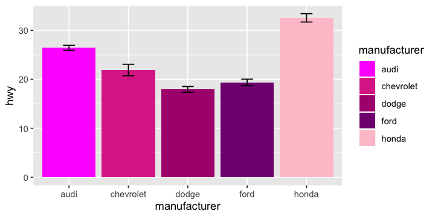<!-- -->

``` r
# with pre-defined color scales

p + scale_fill_grey()      # grey scale
p + scale_fill_viridis_d() # color blind and color printing friendly palette

# with pre-defined color scales from RColorBrewer

p + scale_fill_brewer(palette = "Pastel1")
```

``` r
RColorBrewer::display.brewer.all()
```

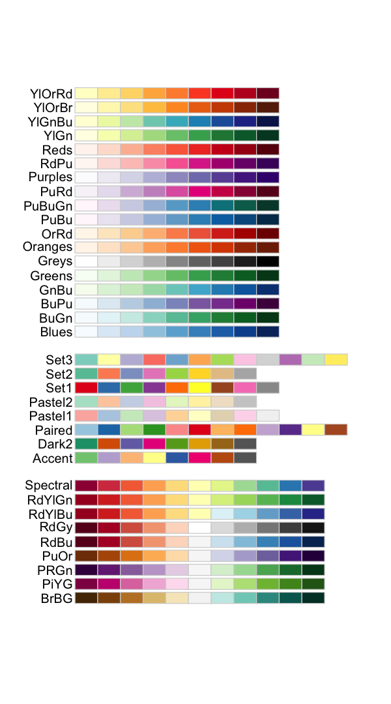<!-- -->

### Stripes and Patterns

These are disencouraged and therefore not supported in `ggplot2`.

### Point Shapes

Typically, the color of the entire shape is set with `color = ...`. Only
some shapes accept a different `fill = ...` color from the border color.

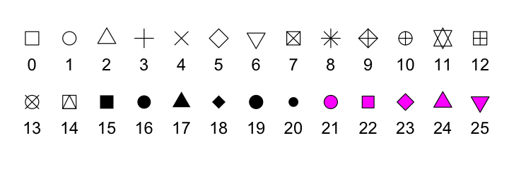<!-- -->

### Linetypes

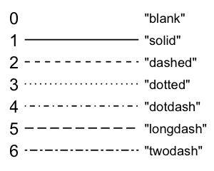<!-- -->

To modify the line end style, there is the parameter `lineend = ...`,
which can take the values `"round"`, `"butt"`, or `"square"`.

## Common Dimensions and Layout Parameters

| parameter | effect                                          |
| --------- | ----------------------------------------------- |
| `unit`    | unit of dimensions; defaults `"pt"`             |
| `size`    | line/border size in `"mm"`; text size in `"pt"` |

This means, if you want to specify the line width in points, you will
need the following conversion.

``` r
size = grid::convertUnit(unit(8, "pt"), "mm", valueOnly = TRUE)
```

| parameter | effect                                           |
| --------- | ------------------------------------------------ |
| `hjust`   | horizontal anchor between 0 (left) and 1 (right) |
| `vjust`   | vertical anchor between 0 (bottom) and 1 (top)   |
| `angle`   | rotation around justification anchor             |

An overview of the various effects; modified from [this
source](https://gist.github.com/cdesante/4070548).

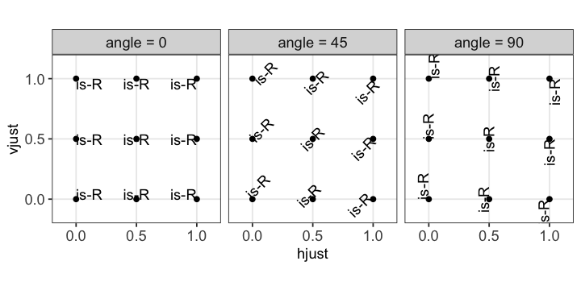<!-- -->

## Themes

A `theme` controls all non-data parts of a plot. This is anything from
the default shading of the canvas, the line widths of the grid or the
color of the axes labels.

### Predefined Themes

Let’s briefly look how the default themes in `ggplot2` look like.

``` r
p <- p + facet_wrap(vars(year))
p + theme_gray() # the default theme in ggplot2
```

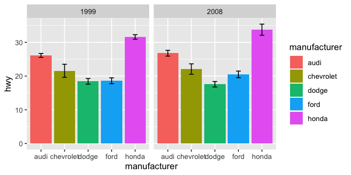<!-- -->

``` r
p + theme_bw()
```

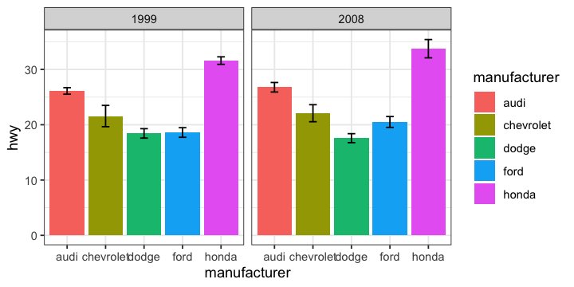<!-- -->

``` r
p + theme_linedraw()
```

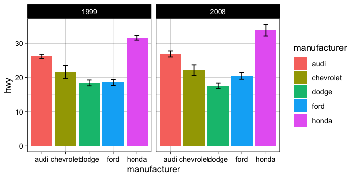<!-- -->

``` r
p + theme_light()
```

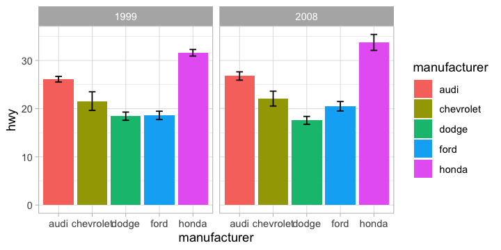<!-- -->

``` r
p + theme_dark()
```

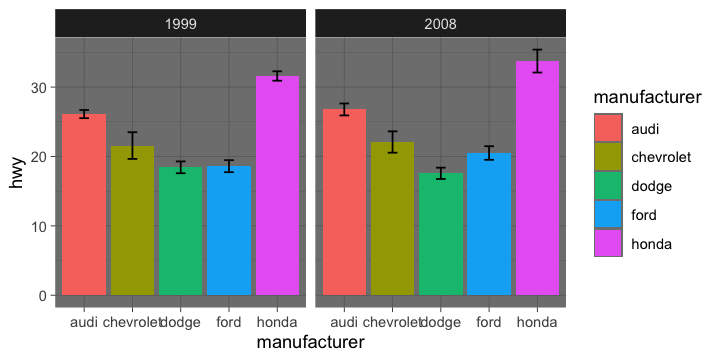<!-- -->

``` r
p + theme_classic()
```

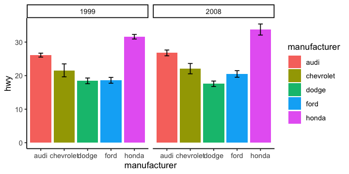<!-- -->

``` r
p + theme_void() # a completely empty theme
```

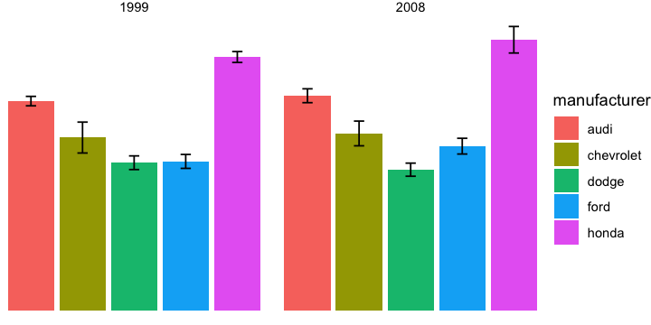<!-- -->

### Modifying Components of a Theme

Parameters to change the style or layout of distinct elements in a plot
are set via `theme(...)`.

``` r
p + scale_fill_grey() + theme_grey() + theme(
  # place legend below plot
  legend.position = "bottom",
  # remove major gird lines on x axis
  panel.grid.major.x = element_blank(),
  # color minor grid lines on y axis
  panel.grid.minor.y = element_line(color = "red", linetype = "dashed"),
  # fill facet labels
  strip.background = element_rect(fill = "yellow"),
  # make text on y axis larger
  axis.text.y = element_text(size = 14),
  # highlight legend
  legend.box.background = element_rect(color = "green", size = 1)
)
```

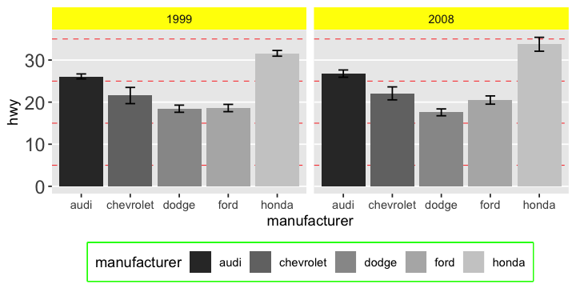<!-- -->

Some frequently and less frequently used parameters are given below.

| parameter                     | modifies                                                          |
| ----------------------------- | ----------------------------------------------------------------- |
| <b>general</b>                | these modify *all* occurences                                     |
| `line`                        | all line elements with `element_line()`                           |
| `rect`                        | all rectangular elements with `element_rect()`                    |
| `text`                        | all text elements with `element_text()`                           |
| `title`                       | all title elements (plot, axes, legends) with `element_text()`    |
| <b>legend</b>                 |                                                                   |
| `legend.position`             | position of the legend, e.g. `"none"`, `"left"`, `"top"` etc.     |
| `legend.background`           | background of legend                                              |
| `legend.title`                |                                                                   |
| `legend.title.align`          |                                                                   |
| `legend.text`                 |                                                                   |
| `legend.text.align`           |                                                                   |
| `legend.key`                  | background underneath keys, via `element_rect()`                  |
| `legend.key.size`             | size via `unit(...)`                                              |
| `legend.direction`            | layout of items, either `"horizontal"` or `"vertical"`            |
| `legend.justification`        | anchor point for positioning legend inside plot                   |
| `legend.box`                  | layout of multiple legends, either `"horizontal"` or `"vertical"` |
| <b>axes titles</b>            |                                                                   |
| `axis.title`                  | both                                                              |
| `axis.title.x`                | x axis, e.g. of `xlab(...)`                                       |
| `axis.title.y`                | y axis, e.g. of `ylab(...)`                                       |
| <b>axes texts</b>             |                                                                   |
| `axis.text`                   | all                                                               |
| `axis.text.x`                 | x axis, e.g. of `scale_x_log10(label = ...)`                      |
| `axis.text.y`                 | y axis, e.g. of `scale_y_log10(label = ...)`                      |
| <b>axes ticks and lines</b>   |                                                                   |
| `axis.ticks`                  | style via `element_line()`                                        |
| `axis.ticks.x`                | x axis                                                            |
| `axis.ticks.y`                | y axis                                                            |
| `axis.ticks.length`           | length via `unit(...)`                                            |
| `axis.ticks.length.x`         | x axis                                                            |
| `axis.ticks.length.y`         | y axis                                                            |
| `axis.line`                   | style via `element_line()`                                        |
| `axis.line.x`                 | x axis                                                            |
| `axis.line.y`                 | y axis                                                            |
| <b>canvas underneath data</b> |                                                                   |
| `panel.background`            |                                                                   |
| `panel.border`                |                                                                   |
| `panel.spacing`               | between facet panels; length via `unit(...)`                      |
| `panel.grid`                  | style via `element_line()`                                        |
| `panel.grid.major`            |                                                                   |
| `panel.grid.minor`            |                                                                   |
| `panel.grid.major.x`          |                                                                   |
| `panel.grid.major.y`          |                                                                   |
| `panel.grid.minor.x`          |                                                                   |
| `panel.grid.minor.y`          |                                                                   |
| <b>facet labels</b>           |                                                                   |
| `strip.background`            |                                                                   |
| `strip.background.x`          |                                                                   |
| `strip.background.y`          |                                                                   |
| `strip.text`                  |                                                                   |
| `strip.text.x`                |                                                                   |
| `strip.text.y`                |                                                                   |
| <b>canvas around data</b>     |                                                                   |
| `plot.background`             | drawn underneath the entire plot                                  |
| `plot.title`                  |                                                                   |
| `plot.subtitle`               |                                                                   |
| `plot.caption`                |                                                                   |
| `plot.tag`                    |                                                                   |
| `plot.tag.position`           |                                                                   |
| `plot.margin`                 | around the entire plot; length via `unit(...)`                    |

<!-- ### Creating Your Own Theme -->
