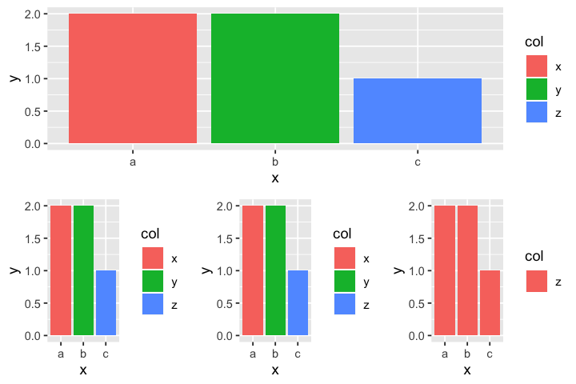
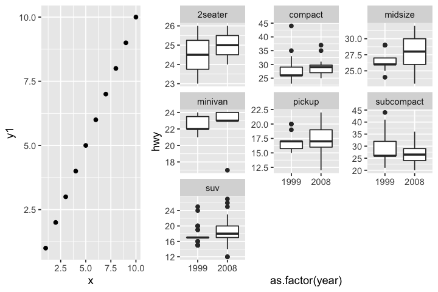
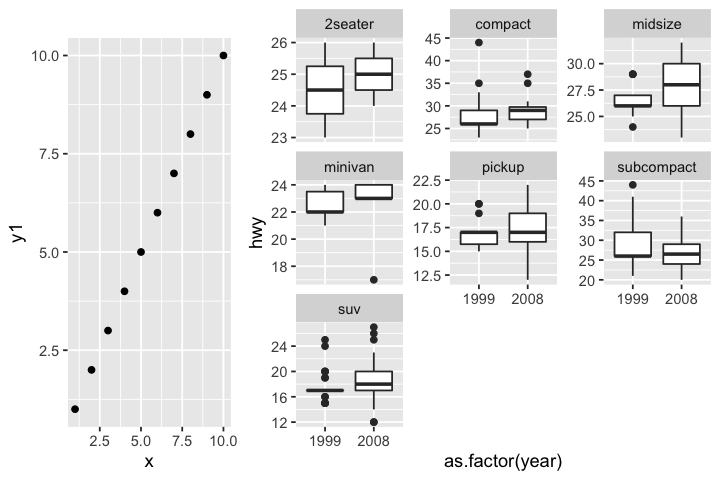
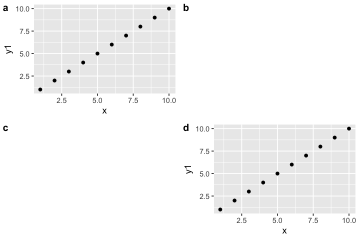

Arranging Plots into Figures
================

  - [Alignments with `gridExtra`](#alignments-with-gridextra)
  - [Alignments with `cowplot`](#alignments-with-cowplot)

-----

Frequently done in third-party applications, but tired of scaling down
or enlarging individual plots and then to align axes later? Here we go.

``` r
library(tidyverse)
```

## Alignments with `gridExtra`

Although this should work out of the box, it produces nice results only
if the space occupied by the legends and plot margins are identical
between the subplots.

``` r
d0 <- read.csv(text="x, y, col\na,2,x\nb,2,y\nc,1,z")
d1 <- read.csv(text="x, y, col\na,2,x\nb,2,y\nc,1,z")
d2 <- read.csv(text="x, y, col\na,2,x\nb,2,y\nc,1,z")
d3 <- read.csv(text="x, y, col\na,2,z\nb,2,z\nc,1,z")
p0 <- ggplot(d0) + geom_col(mapping = aes(x, y, fill = col))
p1 <- ggplot(d1) + geom_col(mapping = aes(x, y, fill = col))
p2 <- ggplot(d2) + geom_col(mapping = aes(x, y, fill = col))
p3 <- ggplot(d3) + geom_col(mapping = aes(x, y, fill = col))

gridExtra::grid.arrange(p0, gridExtra::arrangeGrob(p1, p2, p3, ncol = 3), ncol = 1)
```

<!-- -->

## Alignments with `cowplot`

In more complex (real-life) situations, we need `cowplot`.

These examples are modified from the ‘Examples’ section of
`cowplot::plot_grid`.

``` r
data.frame(x = 1:10, y1 = 1:10, y2 = (1:10)^2, y3 = (1:10)^3, y4 = (1:10)^4) %>% 
  ggplot(aes(x, y1)) + geom_point() ->
  p1

mpg %>% 
  ggplot(aes(as.factor(year), hwy)) +
  geom_boxplot() +
  facet_wrap(~class, scales = "free_y") -> p2

# aligning complex plots in a grid
cowplot::plot_grid(
  p1, p2,
  align = "h", axis = "b", nrow = 1, rel_widths = c(1, 2)
)
```

<!-- -->

``` r
# can align top of plotting area as well as bottom
cowplot::plot_grid(
  p1, p2,
  align = "h", axis = "tb",
  nrow = 1, rel_widths = c(1, 2)
)
```

<!-- -->

``` r
# missing plots in some grid locations generate empty spaces
cowplot::plot_grid(
  p1, NULL, NULL, p1,
  ncol = 2,
  # auto-generate lowercase labels
  labels = "auto",
  label_size = 12,
  align = "v"
)
```

<!-- -->
